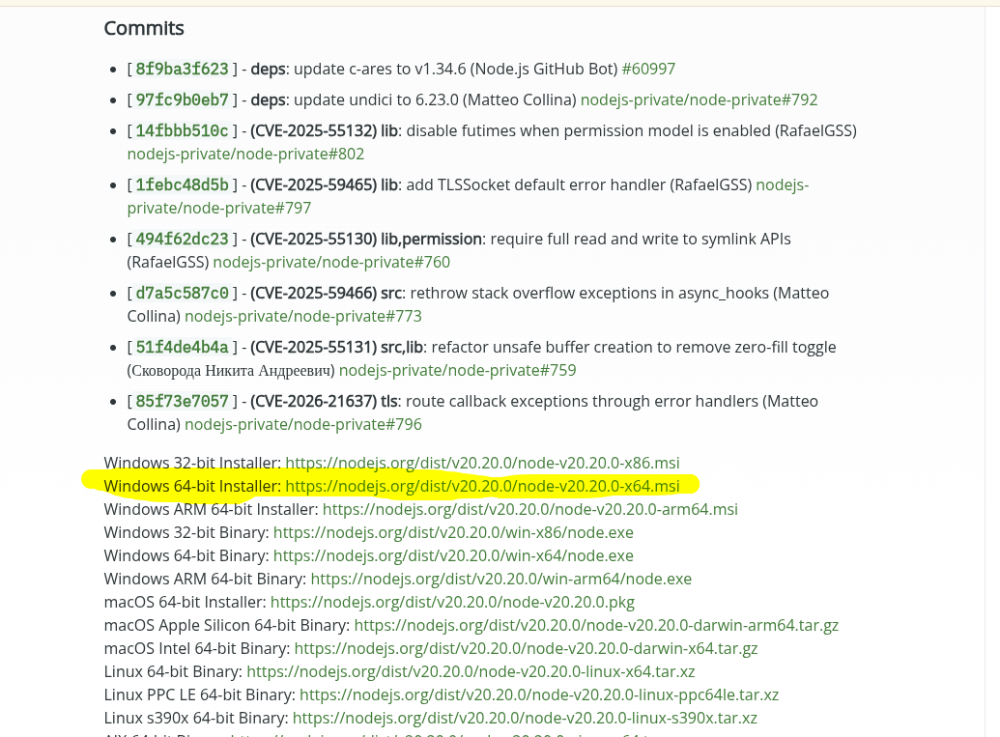
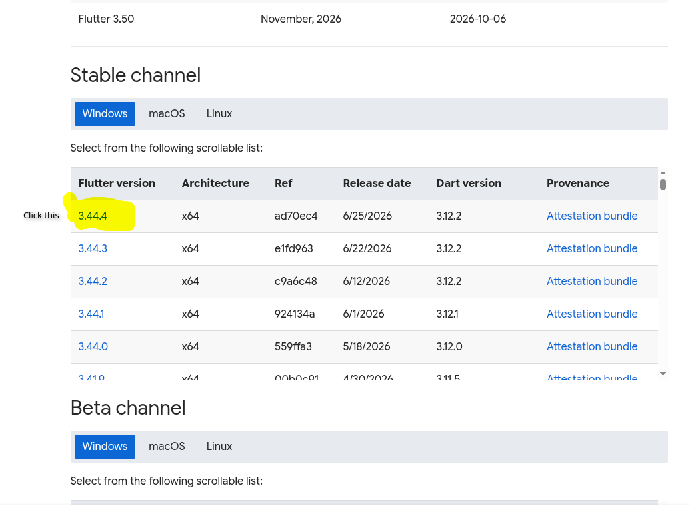
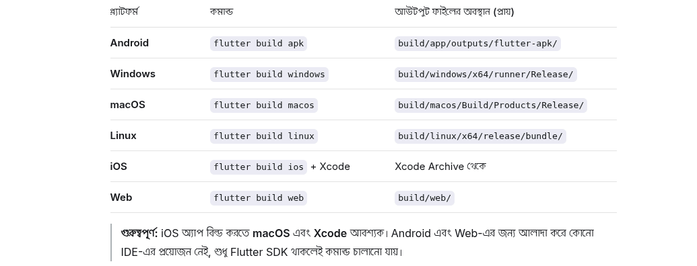

# firebase_login_error_solve


# Complete Firebase Login System Guidelines for Flutter

> **এই গাইডলাইনটি ফলো করলে তুমি Flutter অ্যাপে Firebase Authentication (Email/Password + Google Sign-In) এবং Firebase Hosting সেটআপ করতে পারবে।**  
> প্রতিটি ধাপ আগে থেকে পরে সাজানো আছে যাতে নতুন কেউ হলেও সহজে বুঝতে পারে।

---

## Table of Contents

1. [Step 0: Prerequisites Check](#step-0-prerequisites-check)
2. [Step 1: Install Firebase CLI](#step-1-install-firebase-cli)
3. [Step 2: Login to Firebase](#step-2-login-to-firebase)
4. [Step 3: FlutterFire CLI Setup](#step-3-flutterfire-cli-setup)
5. [Step 4: Configure Firebase in Flutter Project](#step-4-configure-firebase-in-flutter-project)
6. [Step 5: Firebase Authentication Setup](#step-5-firebase-authentication-setup)
7. [Step 6: Flutter Code Implementation](#step-6-flutter-code-implementation)
8. [Step 7: Firebase Hosting Setup](#step-7-firebase-hosting-setup)
9. [Step 8: Deploy to Firebase Hosting](#step-8-deploy-to-firebase-hosting)
10. [Troubleshooting / Common Errors](#troubleshooting--common-errors)

---

## Step 0: Prerequisites Check

সবার আগে নিশ্চিত হও তোমার কম্পিউটারে নিচের টুলগুলো ইনস্টল করা আছে কিনা।

### 0.1 Check Node.js & npm
```bash
node --version
npm --version
```

**Output Example:**
```
v20.11.0
10.2.4
```

- যদি `command not found` দেখায়, তাহলে Node.js ইনস্টল করো:  
   [https://nodejs.org/en/blog/release/v20.20.0](https://nodejs.org/en/blog/release/v20.20.0) (LTS version recommended)
  
  <p align="center">
    
    &nbsp;&nbsp;&nbsp;
    </p>

### 0.2 Check Flutter
```bash
flutter --version
```

**Output Example:**
```
Flutter 3.22.0 • channel stable
Dart 3.4.0
```

- Flutter না থাকলে:  [https://docs.flutter.dev/get-started/install](https://docs.flutter.dev/install/archive?tab)

    <p align="center">
    
    &nbsp;&nbsp;&nbsp;
    </p>

### 0.3 Check Git
```bash
git --version
```
- Git না থাকলে ইনস্টল করো (Firebase CLI এর জন্য দরকার)।

---

## Step 1: Install Firebase CLI

Firebase CLI তোমার টার্মিনাল/কমান্ড প্রম্পট থেকে Firebase সবকিছু কন্ট্রোল করতে দেয়।

### Command:
```bash
npm install -g firebase-tools
```

### Verify Installation:
```bash
firebase --version
```

**Expected Output:**
```
13.0.0   (or any version number)
```

> **Tip:** Windows-এ যদি npm permission error দেয়, তাহলে PowerShell **as Administrator** দিয়ে চালাও।  
> Linux/Mac-এ `sudo` ব্যবহার করতে হতে পারে:
> ```bash
> sudo npm install -g firebase-tools
> ```

---

## Step 2: Login to Firebase

Firebase CLI দিয়ে তোমার Google অ্যাকাউন্টে লগইন করতে হবে।

### Command:
```bash
firebase login
```

### What happens:
- তোমার ব্রাউজার ওপেন হবে Google Sign-In পেজ।
- তোমার Google অ্যাকাউন্ট সিলেক্ট করো যে অ্যাকাউন্ট Firebase Console-এ ব্যবহার করবে।
- Permission Allow করো।
- Terminal-এ `Success! Logged in as your-email@gmail.com` দেখাবে।

### Alternative (No Browser):
```bash
firebase login --no-localhost
```
- এটা তোমার টার্মিনালে লিঙ্ক দেখাবে, ম্যানুয়ালি কপি করে ব্রাউজারে দিতে হবে।

---

## Step 3: FlutterFire CLI Setup

Flutter প্রোজেক্টে Firebase সহজে যুক্ত করার জন্য Google `FlutterFire CLI` বানিয়েছে।

### 3.1 Install FlutterFire CLI
```bash
dart pub global activate flutterfire_cli
```

### 3.2 Verify FlutterFire CLI
```bash
flutterfire --version
```

> **Important:** `dart pub global activate` কমান্ড রান করার পর PATH-এ যুক্ত হতে পারে।  
> যদি `flutterfire: command not found` দেয়, তাহলে terminal restart করো।

---

## Step 4: Configure Firebase in Flutter Project

Flutter প্রোজেক্টের মধ্যে Firebase কনফিগার করার সবচেয়ে সহজ উপায়।

### 4.1 Navigate to your Flutter project
```bash
cd your_flutter_project_name
```

### 4.2 Run FlutterFire Configure
```bash
flutterfire configure
```

### What happens:
- Terminal-ে তোমার Firebase প্রোজেক্ট লিস্ট দেখাবে।
- Existing প্রোজেক্ট সিলেক্ট করো অথবা নতুন প্রোজেক্ট বানাতে `Create a new project` সিলেক্ট করো।
- কোন প্ল্যাটফর্ম (Android, iOS, Web, macOS, Windows, Linux) চাও সিলেক্ট করো।
- FlutterFire CLI অটোমেটিকালি:
  - `android/app/google-services.json` (Android)
  - `ios/Runner/GoogleService-Info.plist` (iOS)
  - `lib/firebase_options.dart` (Flutter Dart config)
  - সব প্ল্যাটফর্মের `build.gradle` / `Info.plist` ফাইল আপডেট করবে।

### Example Interactive Output:
```
? Which Firebase project do you want to use? 
  my-flutter-app-12345 (My Flutter App)
> Create a new project

? What platforms should your configuration support? (Press <space> to select, <a> to toggle all)
> [✓] android
> [✓] ios
> [✓] web

✓ Firebase configuration is complete!
```

### 4.3 Update `main.dart`
```dart
import 'package:firebase_core/firebase_core.dart';
import 'firebase_options.dart';

void main() async {
  WidgetsFlutterBinding.ensureInitialized();
  await Firebase.initializeApp(
    options: DefaultFirebaseOptions.currentPlatform,
  );
  runApp(const MyApp());
}
```

---

## Step 5: Firebase Authentication Setup

### 5.1 Enable Authentication in Firebase Console
1.  [https://console.firebase.google.com/](https://console.firebase.google.com/) ওপেন করো।
2. তোমার প্রোজেক্ট সিলেক্ট করো।
3. **Build** → **Authentication** → **Get Started** ক্লিক করো।
4. **Sign-in method** tab-এ যাও।
5. **Email/Password** → Enable → Save
6. (Optional) **Google** → Enable → প্রোজেক্ট Support Email দাও → Save

### 5.2 Add Firebase Auth Dependency

`pubspec.yaml` ফাইলে `dependencies:` অংশে যোগ করো:
```yaml
dependencies:
  flutter:
    sdk: flutter
  firebase_core: ^3.0.0
  firebase_auth: ^5.0.0
  google_sign_in: ^6.2.0    # (only if using Google Sign-In)
```

তারপর Terminal-এ:
```bash
flutter pub get
```

---

## Step 6: Flutter Code Implementation

### 6.1 Import in your Dart file
```dart
import 'package:firebase_auth/firebase_auth.dart';
import 'package:google_sign_in/google_sign_in.dart';  // (if using Google)
```

### 6.2 Email/Password Login Example
```dart
class AuthService {
  final FirebaseAuth _auth = FirebaseAuth.instance;

  // Sign Up with Email & Password
  Future<User?> signUp(String email, String password) async {
    try {
      UserCredential result = await _auth.createUserWithEmailAndPassword(
        email: email,
        password: password,
      );
      return result.user;
    } catch (e) {
      print('Sign Up Error: $e');
      return null;
    }
  }

  // Sign In with Email & Password
  Future<User?> signIn(String email, String password) async {
    try {
      UserCredential result = await _auth.signInWithEmailAndPassword(
        email: email,
        password: password,
      );
      return result.user;
    } catch (e) {
      print('Sign In Error: $e');
      return null;
    }
  }

  // Sign Out
  Future<void> signOut() async {
    await _auth.signOut();
  }

  // Get Current User
  User? get currentUser => _auth.currentUser;

  // Auth State Stream (for listening login/logout)
  Stream<User?> get authStateChanges => _auth.authStateChanges();
}
```

### 6.3 Google Sign-In Example (Optional)
```dart
Future<User?> signInWithGoogle() async {
  try {
    final GoogleSignInAccount? googleUser = await GoogleSignIn().signIn();
    if (googleUser == null) return null; // User cancelled

    final GoogleSignInAuthentication googleAuth = await googleUser.authentication;

    final credential = GoogleAuthProvider.credential(
      accessToken: googleAuth.accessToken,
      idToken: googleAuth.idToken,
    );

    UserCredential result = await FirebaseAuth.instance.signInWithCredential(credential);
    return result.user;
  } catch (e) {
    print('Google Sign In Error: $e');
    return null;
  }
}
```

### 6.4 StreamBuilder for Auto Login State
```dart
class AuthWrapper extends StatelessWidget {
  final AuthService _auth = AuthService();

  @override
  Widget build(BuildContext context) {
    return StreamBuilder<User?>(
      stream: _auth.authStateChanges,
      builder: (context, snapshot) {
        if (snapshot.connectionState == ConnectionState.waiting) {
          return const Scaffold(body: Center(child: CircularProgressIndicator()));
        }
        if (snapshot.hasData) {
          return HomeScreen();    // User is logged in
        } else {
          return LoginScreen();   // User is NOT logged in
        }
      },
    );
  }
}
```

---

## Step 7: Firebase Hosting Setup

Flutter Web অ্যাপ Firebase Hosting-এ ডিপ্লয় করার জন্য।

### 7.1 Ensure Flutter Web is enabled
```bash
flutter config --enable-web
```

### 7.2 Build Flutter Web App
```bash
flutter build web
```

- আউটপুট তৈরি হবে: `build/web/` ফোল্ডারে

### 7.3 Initialize Firebase Hosting
Flutter প্রোজেক্টের রুটে (যেখানে `pubspec.yaml` আছে):
```bash
firebase init hosting
```

### Interactive Setup:
```
? Are you ready to proceed? Yes

? What do you want to use as your public directory? build/web

? Configure as a single-page app (rewrite all urls to /index.html)? Yes

? Set up automatic builds and deploys with GitHub? No  (or Yes if you want CI/CD)
```

**What it does:**
- `.firebaserc` ফাইল তৈরি করে (প্রোজেক্ট আইডি সেভ করে)।
- `firebase.json` ফাইল তৈরি করে (হোস্টিং কনফিগারেশন)।

### 7.4 Important: Update `firebase.json` for Flutter Web
```json
{
  "hosting": {
    "public": "build/web",
    "ignore": [
      "firebase.json",
      "**/.*",
      "**/node_modules/**"
    ],
    "rewrites": [
      {
        "source": "**",
        "destination": "/index.html"
      }
    ]
  }
}
```

> **Why `rewrites` needed?** Flutter Web single-page application (SPA)। সব রাউট `/index.html`-এ যেতে হবে।

---

## Step 8: Deploy to Firebase Hosting

### 8.1 Build & Deploy
```bash
flutter build web
firebase deploy --only hosting
```

### 8.2 Expected Output
```
✔  Deploy complete!

Project Console: https://console.firebase.google.com/project/your-project-id/overview
Hosting URL: https://your-project-id.web.app
```

### 8.3 Open your deployed app
```bash
firebase hosting:channel:open
```

Or directly visit:
```
https://your-project-id.web.app
```

### 8.4 (Optional) Deploy with custom message
```bash
firebase deploy --only hosting --message "Release v1.0.0"
```


# Flutter different platform apk file generated commands : 

 <p align="center">
    
    &nbsp;&nbsp;&nbsp;
    </p>
---

## Troubleshooting / Common Errors

### Error 1: `firebase: command not found`
**Solution:**
```bash
npm install -g firebase-tools
```
Terminal restart করো। যদি না হয়, তাহলে npm global path যোগ করো:
```bash
export PATH="$PATH:$(npm config get prefix)/bin"
```

### Error 2: `flutterfire: command not found`
**Solution:**
```bash
dart pub global activate flutterfire_cli
```
Terminal restart করো।

### Error 3: `FirebaseOptions not configured for web`
**Solution:**
```bash
flutterfire configure
```
Web সিলেক্ট করোনি কিনা চেক করো।

### Error 4: `SHA-1 certificate error` (Android)
**Solution:**
```bash
cd android
./gradlew signingReport
```
SHA-1 key কপি করে Firebase Console → Project Settings → Android App → SHA-1 certificate-এ যোগ করো।

### Error 5: `Google Sign-In failed`
**Solution:**
- Firebase Console → Authentication → Google → Enable করো।
- SHA-1 যোগ করা আছে কিনা চেক করো।
- `google-services.json` আপডেট করা আছে কিনা চেক করো।

### Error 6: `flutter build web` fails
**Solution:**
```bash
flutter clean
flutter pub get
flutter build web
```

### Error 7: Hosting shows blank white screen
**Solution:**
`firebase.json` এ `rewrites` আছে কিনা চেক করো (Step 7.4 দেখো)।

---

## Quick Command Reference

| Task | Command |
|------|---------|
| Check Node & npm | `node --version` & `npm --version` |
| Install Firebase CLI | `npm install -g firebase-tools` |
| Login to Firebase | `firebase login` |
| Install FlutterFire CLI | `dart pub global activate flutterfire_cli` |
| Configure Firebase | `flutterfire configure` |
| Enable Flutter Web | `flutter config --enable-web` |
| Build Web App | `flutter build web` |
| Init Hosting | `firebase init hosting` |
| Deploy to Hosting | `firebase deploy --only hosting` |
| View Deployed URL | `firebase hosting:open` |
| Logout Firebase | `firebase logout` |

---

## Final Checklist

- [ ] Node.js & npm installed and checked
- [ ] Firebase CLI installed (`firebase --version` works)
- [ ] Logged in to Firebase (`firebase login`)
- [ ] FlutterFire CLI installed (`flutterfire --version` works)
- [ ] Firebase configured in Flutter project (`flutterfire configure`)
- [ ] `firebase_core` & `firebase_auth` added to `pubspec.yaml`
- [ ] Authentication enabled in Firebase Console
- [ ] Login/SignUp code implemented in Flutter
- [ ] Flutter Web enabled (`flutter config --enable-web`)
- [ ] Firebase Hosting initialized (`firebase init hosting`)
- [ ] App deployed successfully (`firebase deploy --only hosting`)

---

> **Congratulations!** তুমি এখন Firebase Authentication + Hosting সহ_COMPLETE Flutter অ্যাপ বানাতে ও ডিপ্লয় করতে পারবে!

> **Need Help?**  
> Firebase Docs: [https://firebase.google.com/docs](https://firebase.google.com/docs)  
> FlutterFire Docs: [https://firebase.flutter.dev/](https://firebase.flutter.dev/)
